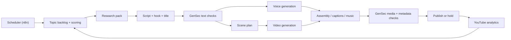

# Architecture

## Objective

Produce `2-3` vertically formatted YouTube Shorts per day from a single channel thesis, with a controlled path from operator-assisted publishing to full automation.

## Core principle

Treat this as a media pipeline, not a prompt chain.

That means five engines working together:

1. Editorial engine: decides what to make.
2. Research engine: builds a source-backed fact pack.
3. Production engine: writes, voices, renders, assembles.
4. GenSec engine: blocks unsafe, weak, or non-compliant output.
5. Publishing engine: uploads, schedules, and tracks performance.

## Recommended system shape

## Division of responsibilities

### n8n

- schedules batches
- fans out jobs
- stores run state and operator approvals
- calls OpenAI and external providers
- uploads to YouTube
- triggers retries and notifications

### TypeScript worker in this repo

- prompt templates
- schemas for structured outputs
- topic scoring
- script and scene contracts
- GenSec policy rules
- cost and run budgeting
- provider abstraction layer

## Pipeline stages

### 1. Topic discovery

Inputs:

- channel theme
- lane definitions
- recent uploads
- banned or exhausted topics
- trend or search seeds

Outputs:

- ranked topic candidates
- estimated novelty score
- risk score
- expected retention hook

### 2. Research pack

The system should build a compact fact pack before script generation.

Minimum standard:

- short summary
- key claims
- source links
- disputed or uncertain facts flagged explicitly

The important rule is simple: script writing should consume a fact pack, not raw vibes.

### 3. Script generation

Target output:

- `30-45` seconds
- hard hook in the first `1-2` seconds
- `5-7` scene beats
- one clear payoff
- one lightweight CTA

### 4. Voice and scene planning

Script output should branch into two artifacts:

- voiceover narration
- scene-by-scene render prompts

This keeps voice timing and visual timing coordinated.

### 5. Video generation and assembly

For MVP, keep clips short and composable:

- `5-8` seconds per scene
- `4-6` scenes per Short
- portrait output
- captions burned in or attached in a predictable step

Composition may stay inside the video provider when possible, but a local `ffmpeg` pass is still useful for:

- concatenation
- loudness normalization
- caption burn-in
- music ducking
- final export checks

### 6. Publish and feedback

Every publish event should store:

- topic lane
- title
- first-line hook
- visual style
- render provider
- cost
- publish time
- performance after 1 hour, 24 hours, and 7 days

That is what lets the editorial engine learn.

## GenSec engine

Here "GenSec" means generation security and governance, not only moderation.

### Gate 1: topic policy

Default blocked for autopublish:

- medical advice
- financial advice
- elections and live political persuasion
- active conflicts
- real-person defamation
- celebrity likeness mimicry
- minors in sensitive scenarios

### Gate 2: claim safety

Rules:

- no unsupported factual claim in final script
- all numbers must trace back to the research pack
- uncertainty must stay visible instead of being smoothed away

### Gate 3: IP and likeness safety

Rules:

- do not imitate another creator's format too closely
- do not clone non-owned voices
- avoid trademark-heavy visual prompts
- avoid real-person synthetic depictions unless policy explicitly allows it

### Gate 4: provider safety

Rules:

- run moderation on prompts, scripts, and selected images
- reject prompt injection or unsafe tool outputs
- cap per-run spend
- enforce retry limits and dead-letter failed jobs

### Gate 5: platform compliance

Rules:

- populate YouTube altered/synthetic disclosure when required
- persist metadata used for upload
- log why an item was auto-published or held

## Operating model

### Phase A: shadow mode

- fully automated generation
- human approves every publish
- collect failure reasons

### Phase B: low-risk autopublish

- only approved content lanes
- only medium or lower risk scores
- only after quality gates pass

### Phase C: scaled autopublish

- `2-3` daily videos
- automated retry and backfill
- analytics feedback loop adjusts topic selection

## Recommended first provider mix

- text planning and scripting: OpenAI text models
- TTS: OpenAI speech models
- moderation: OpenAI moderation model plus local policy rules
- video: OpenAI `sora-2` first because `n8n` already exposes native video generation, with external providers as adapters later

Inference:

Using a provider already exposed in `n8n` reduces integration risk for the first workflow. If a second video provider wins on style later, we can swap only the adapter layer.

